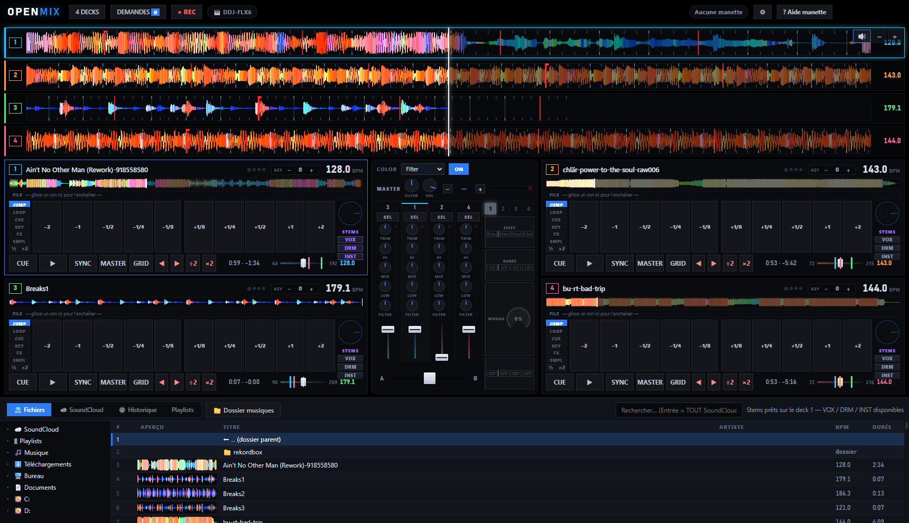

# OpenMix

**Le logiciel DJ libre et gratuit — 4 decks, platines DDJ et tout matériel DJ
USB-MIDI, manettes de jeu, téléphones.**



OpenMix remplace les logiciels DJ payants : analyse BPM/grille au niveau de
Rekordbox (validée contre ses propres fichiers d'analyse), mix à 4 platines,
et une idée que personne d'autre n'a : **jusqu'à 4 joueurs mixent ensemble à
la manette**, plus une console tactile sur téléphone et un système de
demandes du public — le tout 100 % local, sans cloud, sans abonnement.

## Fonctionnalités

- **4 decks** avec vagues 3 bandes, grilles de temps rigides (analyse v13 :
  balayage BPM double-score, verrouillage entier, ancrage kick), sync
  intelligent (le master n'est jamais recalé, ton placement au jog est
  respecté), key shift, beat jump, boucles calées **et** manuelles IN/OUT,
  hot cues persistants (10 par piste)
- **Multi-joueurs à la manette** (PS/Xbox) : matrice de contrôle navigable,
  modes JUMP/LOOP/CUE/KEY par joueur, sélections par joueur avec effets FX
  personnels, bascule de basses exclusive, reset du mix sur R1
- **STEMS** : séparation voix/batterie/basse/instru (Demucs, local) avec
  mute par groupe
- **SoundCloud** : connexion à ton compte, playlists, et recherche dans TOUT
  le catalogue (Entrée dans la barre de recherche)
- **Console téléphone** (page web ou APK Android fournie) : 2 platines
  paysage, jog wheels, pads, EQ, faders, bibliothèque — pilote le PC en WiFi
- **Demandes du public** : tes invités scannent une URL, votent les morceaux
  et t'envoient des messages — l'équivalent de CoBeat, gratuit et local
- **Grilles Rekordbox** : importe les analyses de ton ancien Rekordbox
  (fichiers ANLZ) pour une transition sans douleur
- **Platines & contrôleurs DJ** : compatible avec les DDJ Pioneer et tout
  matériel DJ USB-MIDI — chaque bouton est mappable (voir ci-dessous)
- Enregistrement du mix, mode 2 ou 4 decks

## Platines & contrôleurs DJ (MIDI)

OpenMix fonctionne avec **n'importe quel contrôleur DJ USB-MIDI** — aucun
driver à installer, branche et c'est parti :

- **Pioneer DDJ reconnues automatiquement** : préréglage 4 voies complet,
  relevé sur une vraie DDJ-FLX6 — jogs à deux surfaces (dessus = scratch,
  côté = calage fin), volumes, trim, EQ 3 bandes, filtres, tempo, play/cue/
  sync, boucles IN/OUT/reloop, pads performance, section FX, channel select,
  crossfader, et navigation complète de la bibliothèque à l'encodeur
  (entrer/sortir des dossiers et playlists, bouton VIEW)
- **Tout autre matériel** (Numark, Hercules, Traktor, Denon, claviers MIDI…) :
  **chaque bouton, fader, knob ou jog est mappable par apprentissage** —
  ouvre ⚙ Paramètres, clique l'action voulue, touche le contrôle physique,
  c'est lié. Le mapping est mémorisé PAR appareil et survit aux redémarrages
- Notes, CC (absolus et relatifs) et pitch bend 14 bits sont gérés — les
  faders tempo haute résolution marchent aussi

## Installation (PC)

### Le plus simple : l'installeur Windows

1. Va sur la page [Releases](https://github.com/blackmagic42/openmix/releases)
2. Télécharge **`OpenMix-Setup-x.y.z.exe`**
3. Double-clique : OpenMix s'installe et se lance tout seul (raccourci créé)

> Windows SmartScreen peut afficher un avertissement (application non signée —
> les certificats coûtent cher, OpenMix est gratuit) : clique sur
> « Informations complémentaires » → « Exécuter quand même ».

### Depuis les sources (développeurs)

Prérequis : [Node.js](https://nodejs.org) 20+.

```bash
git clone https://github.com/blackmagic42/openmix.git
cd openmix/turbo-mix
npm install
npm start
```

### Construire soi-même l'installeur

```bash
cd openmix/turbo-mix
npm install
npm run dist          # → dist/OpenMix-Setup-x.y.z.exe (installeur NSIS)
npm run dist:portable # → version portable sans installation
```

> ⚠️ Si la fenêtre ne s'ouvre pas : vérifie que la variable d'environnement
> `ELECTRON_RUN_AS_NODE` n'est pas définie dans ton terminal.

Optionnel :
- **STEMS** : `pip install demucs` (Python 3.10+). La séparation se fait en
  arrière-plan, en priorité basse, jamais pendant la lecture.
- **Grilles Rekordbox** : si Rekordbox est installé sur le même PC, bouton
  d'import dans ⚙ Paramètres.

## Console téléphone

Le serveur démarre automatiquement avec l'app (port **8722**).

- **Navigateur** : ouvre `http://IP_DU_PC:8722` sur le téléphone (même WiFi)
- **APK Android** : installe `turbo-mix/OpenMix.apk` (12 Ko) — plein écran
  paysage, l'IP est demandée au premier lancement puis mémorisée
- **Invités / demandes** : fais scanner `http://IP_DU_PC:8722/guest` — votes
  et messages arrivent dans le bouton DEMANDES de la barre du haut

L'interface téléphone est servie depuis `src/remote.html` : elle est relue à
chaque chargement, donc modifiable sans réinstaller l'APK.

## Manette

Branche une manette (jusqu'à 4). Appui long sur Share/View = aide complète
des commandes à l'écran. Chaque joueur a sa couleur, son mode de pads, ses
sélections et son unité FX personnelle.

### Les boutons

La croix directionnelle déplace ton curseur sur la **matrice de contrôle** :
les colonnes sont les decks (+ le rack FX à droite), les rangées sont les
knobs (TRIM → HI → MID → LOW → FILTER), la rangée du haut est le MASTER, et
sous FILTER on passe en **navigation bibliothèque**.

| Bouton | Action |
|---|---|
| **Croix ◀▶▲▼** | Se déplacer sur la matrice (decks × knobs, MASTER en haut, rack FX à droite, bibliothèque en bas) |
| **Croix / A** | Play/Pause · en navigation : ouvrir une playlist ou **charger et lancer** le morceau (re-appui = pause) |
| **Rond / B** (court) | FX + FILTRE à 0 (la sélection est conservée) + knob survolé remis au neutre · en navigation : retour |
| **Rond / B** (long) | Sélection **CUT** (voir plus bas) |
| **Carré / X** (court) | Durée du FX : 1/2 → 3/4 → 1 → 2 temps |
| **Carré / X** (enfoncé) | La liste des effets s'affiche et défile — relâche sur celui que tu veux |
| **Triangle / Y** | **CUT** : coupe d'un coup les decks sélectionnés — re-appui, tout revient d'un coup |
| **L1 / R1** | Volume de la piste − / + (maintenir) · rangée MASTER : le knob master survolé · **R1 avec une sélection : TOUT à 0 + désélection** |
| **L2 / R2** | Les **pads** : moitié gauche / droite, la rangée donne la force (TRIM = fort → FILTER = fin) · colonne FX : durée ÷2 / ×2 · rangée MASTER : BPM − / + (les decks syncés suivent) |
| **Share/View** (court) | Changer TON mode de pads : JUMP → LOOP → CUE → KEY → PAD FX → SAMPLER (chaque joueur garde le sien) |
| **Share/View** (long) | L'aide complète à l'écran |
| **Options/Menu** | BEAT SYNC du deck ON/OFF |
| **Stick gauche ▲▼** | Le knob survolé · **avec une sélection : les FILTRES de toutes tes tracks sélectionnées** |
| **Stick gauche ◀▶** (maintenu ½ s) | Décaler le son façon jog CDJ (au relâcher, le calage auto garde ton alignement) · **boucle active : régler la boucle** (▶ +1 segment, ◀ réduire) |
| **Stick droit ▲▼** | **Niveau du FX** de la track (rangée MASTER = tous) |
| **Stick droit ◀▶** (maintenu ½ s) | Zoom / dézoom des vagues |
| **L3** (clic stick gauche) | FILTRE général ON/OFF (COLOR) |
| **R3** (clic stick droit) | **Sélectionner la track** (voir plus bas) · colonne FX : unité ON/OFF |
| **Bouton PS/Xbox** | Couper / remettre le knob survolé · sur LOW : les **basses passent à ce deck** (jamais deux basses en même temps) |

### Le mode SÉLECTION (le cœur du jeu à plusieurs)

Appuie sur **R3** sur un deck : la track est **sélectionnée** dans ta couleur
— son FX et son filtre sont armés d'un coup. Re-appuie pour la retirer, et tu
peux en sélectionner plusieurs (elles réagissent alors toutes ensemble).

Tant que tu as une sélection :

- **Stick gauche ▲▼ = le FILTRE** de toutes tes tracks sélectionnées en même
  temps (le stick droit reste le FX — jamais l'inverse) ;
- **Stick droit ▲▼ = le niveau du FX** appliqué à ta sélection, avec TON
  unité FX personnelle (chaque joueur a la sienne) ;
- **L2 / R2 = la durée du FX** (÷2 / ×2) au lieu des pads — sauf en mode
  LOOP, où les pads de boucle gardent la priorité ;
- **Rond court = tout à zéro** (FX coupé, filtre au neutre) mais la sélection
  et l'armement RESTENT : tu peux relancer un effet aussitôt ;
- **R1 = le grand reset** : FX à zéro, filtres au neutre ET désélection —
  retour immédiat à un mix propre ;
- **Triangle = CUT** : les decks sélectionnés se coupent net, re-appui et
  tout revient — l'effet « drop » classique ;
- Deux joueurs peuvent sélectionner **le même deck** : leurs effets se
  combinent, l'affichage montre la couleur de chacun.

## L'API HTTP (le « SDK » d'OpenMix)

Tout OpenMix se pilote par HTTP sur le port 8722 — de quoi construire tes
propres télécommandes, bots ou intégrations :

| Route | Méthode | Description |
|---|---|---|
| `/` | GET | Console téléphone (HTML) |
| `/guest` | GET | Page invités : votes + messages (HTML) |
| `/state` | GET | État complet du mix (JSON, ~400 ms de fraîcheur) : decks (titre, BPM, position, tempo, volume, filtre, EQ, boucle, cues, master, sync), crossfader, BPM master, volume master |
| `/wave?d=N` | GET | Vague compacte du deck N (24 pts/s, 3 bandes 0-255) |
| `/lib` | GET | Bibliothèque courante (noms + BPM) |
| `/requests` | GET | Votes et messages des invités (JSON) |
| `/cmd` | POST | Commande JSON — voir ci-dessous |
| `/vote` | POST | `{"name": "titre", "bpm": 128}` pour voter, `{"msg": "texte"}` pour un message |

### Commandes `/cmd`

```json
{"action": "play",    "deck": 0}
{"action": "cue",     "deck": 0}
{"action": "sync",    "deck": 0}
{"action": "vol",     "deck": 0, "value": 0.8}
{"action": "filter",  "deck": 0, "value": -0.3}
{"action": "trim",    "deck": 0, "value": 0.1}
{"action": "eq",      "deck": 0, "band": "low", "value": -1}
{"action": "bass",    "deck": 1}
{"action": "jump",    "deck": 0, "value": -1}
{"action": "hotcue",  "deck": 0, "value": 2}
{"action": "pad",     "deck": 0, "mode": "loop", "value": 7}
{"action": "loopin",  "deck": 0}
{"action": "loopout", "deck": 0}
{"action": "tempo",   "deck": 0, "value": 1.02}
{"action": "load",    "deck": 0, "value": 12}
{"action": "mbpm",    "value": 1}
{"action": "mvol",    "value": 0.9}
{"action": "xf",      "value": 0.5}
```

## Structure du code

```
turbo-mix/
├── main.js            Processus principal Electron : fenêtre, serveur HTTP
│                      (console/invités), SoundCloud, Demucs, grilles Rekordbox
├── preload.js         Pont sécurisé renderer ↔ main
├── src/
│   ├── index.html     Interface principale
│   ├── styles.css     Design system « noir total, un accent »
│   ├── remote.html    Console téléphone (2 decks paysage)
│   ├── guest.html     Page invités (votes/messages)
│   └── js/
│       ├── app.js     UI, decks, mixer, manettes multi-joueurs, FX
│       ├── engine.js  Moteur audio Web Audio : decks, sync/PLL, FX, stems
│       ├── bpm.js     Analyse BPM/grille v13
│       ├── library.js Bibliothèque, cache, SoundCloud, analyse en file
│       ├── gamepad.js Mapping manettes (jusqu'à 4 joueurs)
│       ├── waveform.js Rendu des vagues (zoom + minimap)
│       └── midi.js    Mapping MIDI par apprentissage
└── android-app/       Source de l'APK (WebView plein écran, build sans Gradle)
```

## Rebuild de l'APK

Nécessite le SDK Android (build-tools 34+, platform android-34) et un JDK :

```
javac → jar → d8 (build-tools 36) → aapt package → zipalign → apksigner
```

Le détail des commandes est dans `android-app/` — l'APK ne change que si le
code natif change ; l'interface, elle, vit sur le PC.

## Licence

MIT — libre d'utilisation, de modification et de partage.
**OpenMix : libérer le mix.**
